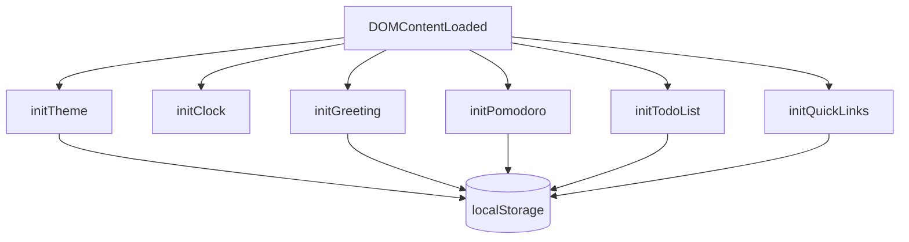

# Design Document: Todo Life Dashboard

## Overview

A single-page, client-side productivity dashboard built with plain HTML, CSS, and vanilla JavaScript. The app is composed of exactly three files (`index.html`, `css/style.css`, `js/script.js`) and is deployable on GitHub Pages with no build step or external dependencies.

The dashboard provides six integrated widgets:
- Real-time clock and date display
- Contextual time-based greeting with user name
- Pomodoro countdown timer
- To-do list with add/edit/complete/delete
- Quick links bookmark manager
- Light/dark theme toggle

All state is persisted in `localStorage`. No backend, no frameworks.

---

## Architecture

The app follows a simple **widget-per-module** pattern inside a single JS file. Each widget owns its DOM references, its state, and its `localStorage` key. Widgets are initialized sequentially on `DOMContentLoaded`.



There is no shared state bus or event system between widgets. Each widget reads/writes its own `localStorage` key independently.

### File Structure

```
index.html          ← markup, widget containers, script/style links
css/style.css       ← design tokens (CSS custom properties), layout, widget styles
js/script.js        ← all widget logic, initialization, localStorage I/O
```

---

## Components and Interfaces

### Clock Widget

- **DOM**: `#clock` (time display), `#date` (date display)
- **Behavior**: `setInterval` at 1000ms, formats `Date` to `HH:MM:SS` and full date string
- **No localStorage** — purely derived from system time

### Greeting Widget

- **DOM**: `#greeting` (text), `#name-input` (text field)
- **localStorage key**: `dashboard_name`
- **Interface**:
  - `getGreeting(hour: number): string` — pure function returning greeting phrase
  - `loadName(): string | null` — reads from localStorage
  - `saveName(name: string): void` — writes to localStorage

### Pomodoro Timer

- **DOM**: `#timer-display`, `#btn-start`, `#btn-pause`, `#btn-reset`
- **State**: `secondsLeft: number`, `intervalId: number | null`
- **Interface**:
  - `startTimer(): void`
  - `pauseTimer(): void`
  - `resetTimer(): void`
  - `formatTime(seconds: number): string` — returns `MM:SS`

### Todo List

- **DOM**: `#todo-input`, `#btn-add-todo`, `#todo-list` (container)
- **localStorage key**: `dashboard_todos`
- **Data model**: `Task { id: string, text: string, completed: boolean }`
- **Interface**:
  - `loadTasks(): Task[]`
  - `saveTasks(tasks: Task[]): void`
  - `addTask(text: string): Task | null` — returns null on validation failure
  - `toggleTask(id: string): void`
  - `editTask(id: string, newText: string): void`
  - `deleteTask(id: string): void`
  - `renderTasks(): void`

### Quick Links

- **DOM**: `#link-name-input`, `#link-url-input`, `#btn-add-link`, `#links-container`
- **localStorage key**: `dashboard_links`
- **Data model**: `Link { id: string, name: string, url: string }`
- **Interface**:
  - `loadLinks(): Link[]`
  - `saveLinks(links: Link[]): void`
  - `addLink(name: string, url: string): Link | null` — returns null on validation failure
  - `deleteLink(id: string): void`
  - `renderLinks(): void`

### Theme Toggle

- **DOM**: `#btn-theme-toggle`
- **localStorage key**: `dashboard_theme`
- **Behavior**: Toggles `data-theme="dark"` attribute on `<html>`. CSS custom properties are scoped to `[data-theme="dark"]` selector.
- **Interface**:
  - `loadTheme(): 'light' | 'dark'`
  - `applyTheme(theme: 'light' | 'dark'): void`
  - `toggleTheme(): void`

---

## Data Models

### Task

```js
{
  id: string,        // crypto.randomUUID() or Date.now().toString()
  text: string,      // non-empty, trimmed
  completed: boolean // false on creation
}
```

Stored as a JSON array under `localStorage.getItem('dashboard_todos')`.

### Link

```js
{
  id: string,   // crypto.randomUUID() or Date.now().toString()
  name: string, // display label
  url: string   // must start with http:// or https://
}
```

Stored as a JSON array under `localStorage.getItem('dashboard_links')`.

### Theme Preference

Stored as a plain string (`'light'` or `'dark'`) under `localStorage.getItem('dashboard_theme')`.

### User Name

Stored as a plain string under `localStorage.getItem('dashboard_name')`.

### CSS Design Tokens

Defined as CSS custom properties on `:root` (light mode defaults) and overridden on `[data-theme="dark"]`:

| Token | Light | Dark |
|---|---|---|
| `--color-primary` | `#7FB77E` | `#5C8D89` |
| `--color-accent` | `#F7C8A0` | `#E8A87C` |
| `--color-bg` | `#FFF9F5` | `#1E1E1E` |
| `--color-surface` | `#FFFFFF` | `#2A2A2A` |
| `--text-primary` | `#2F2F2F` | `#F5F5F5` |
| `--text-secondary` | `#6B6B6B` | `#B0B0B0` |

Layout constants (not theme-dependent):
- Max content width: `1200px`
- Grid: `repeat(auto-fill, minmax(280px, 1fr))`
- Card border-radius: `16px`
- Button/input border-radius: `10px`
- Base spacing unit: `8px`
- Card box-shadow: `0 10px 25px rgba(0,0,0,0.1)`
- Transition: `0.2s–0.3s ease`

---


## Correctness Properties

*A property is a characteristic or behavior that should hold true across all valid executions of a system — essentially, a formal statement about what the system should do. Properties serve as the bridge between human-readable specifications and machine-verifiable correctness guarantees.*

### Property 1: Clock time format

*For any* `Date` object, the `formatTime(date)` function SHALL return a string matching the pattern `HH:MM:SS` (two-digit hours, minutes, and seconds separated by colons).

**Validates: Requirements 2.1**

---

### Property 2: Clock date format

*For any* `Date` object, the `formatDate(date)` function SHALL return a string that contains a weekday name, a numeric day, a month name, and a four-digit year.

**Validates: Requirements 2.2**

---

### Property 3: Greeting phrase correctness

*For any* integer hour in the range [0..23], `getGreeting(hour)` SHALL return exactly one of "Good Morning", "Good Afternoon", "Good Evening", or "Good Night", and the returned phrase SHALL correspond to the correct time range as specified (Morning: 5–11, Afternoon: 12–15, Evening: 16–18, Night: 19–23 and 0–4).

**Validates: Requirements 3.1, 3.2, 3.3, 3.4**

---

### Property 4: Greeting text composition

*For any* valid non-empty name string and any hour in [0..23], `buildGreetingText(hour, name)` SHALL return a string that contains both the correct greeting phrase and the name.

**Validates: Requirements 3.5**

---

### Property 5: Name persistence round-trip

*For any* non-empty name string, calling `saveName(name)` followed by `loadName()` SHALL return the same name string.

**Validates: Requirements 3.6, 3.7**

---

### Property 6: Timer reset invariant

*For any* timer state (any value of `secondsLeft`), calling `resetTimer()` SHALL always result in `secondsLeft` being exactly 1500 (25 × 60) and the display showing "25:00".

**Validates: Requirements 4.5**

---

### Property 7: Timer non-negative invariant

*For any* sequence of `tick()` operations on the timer, `secondsLeft` SHALL never go below zero.

**Validates: Requirements 4.6**

---

### Property 8: Single interval invariant

*For any* number of consecutive `startTimer()` calls, at most one `setInterval` handle SHALL be active at any given time (i.e., `intervalId` is always replaced, never stacked).

**Validates: Requirements 4.7**

---

### Property 9: Task addition and structure

*For any* non-empty, non-whitespace, non-duplicate task text, `addTask(text)` SHALL return a Task object with a non-empty string `id`, a `text` equal to the trimmed input, and `completed` equal to `false`, and the task SHALL appear in `loadTasks()`.

**Validates: Requirements 5.1, 5.9**

---

### Property 10: Whitespace task rejection

*For any* string composed entirely of whitespace characters (including the empty string), `addTask(text)` SHALL return `null` and the task list length SHALL remain unchanged.

**Validates: Requirements 5.2**

---

### Property 11: Duplicate task rejection

*For any* task already present in the list, calling `addTask` with any case variation of that task's text SHALL return `null` and the task list length SHALL remain unchanged.

**Validates: Requirements 5.3**

---

### Property 12: Toggle isolation

*For any* task list containing at least one task, and any valid task `id`, calling `toggleTask(id)` SHALL flip only that task's `completed` property and leave all other tasks' `completed` values unchanged.

**Validates: Requirements 5.4**

---

### Property 13: Task deletion

*For any* task list and any valid task `id` present in the list, calling `deleteTask(id)` SHALL result in no task with that `id` remaining in the list, and all other tasks SHALL remain unchanged.

**Validates: Requirements 5.6**

---

### Property 14: Todo list persistence round-trip

*For any* sequence of `addTask`, `editTask`, `toggleTask`, and `deleteTask` operations, calling `loadTasks()` immediately after each operation SHALL return a list that reflects the current in-memory state.

**Validates: Requirements 5.7, 5.8**

---

### Property 15: Valid link acceptance

*For any* non-empty name and URL string that begins with `http://` or `https://`, `addLink(name, url)` SHALL add the link to the list and the link SHALL appear in `loadLinks()`.

**Validates: Requirements 6.1**

---

### Property 16: Invalid URL rejection

*For any* URL string that does NOT begin with `http://` or `https://`, `addLink(name, url)` SHALL return `null` and the links list length SHALL remain unchanged.

**Validates: Requirements 6.2**

---

### Property 17: Link deletion

*For any* links list and any valid link `id` present in the list, calling `deleteLink(id)` SHALL result in no link with that `id` remaining in the list, and all other links SHALL remain unchanged.

**Validates: Requirements 6.4**

---

### Property 18: Links persistence round-trip

*For any* sequence of `addLink` and `deleteLink` operations, calling `loadLinks()` immediately after each operation SHALL return a list that reflects the current in-memory state.

**Validates: Requirements 6.5, 6.6**

---

### Property 19: Theme toggle round-trip

*For any* initial theme (`'light'` or `'dark'`), calling `toggleTheme()` twice SHALL return the theme to its original value.

**Validates: Requirements 7.2**

---

### Property 20: Theme persistence round-trip

*For any* theme value (`'light'` or `'dark'`), calling `applyTheme(theme)` (which saves to localStorage) followed by `loadTheme()` SHALL return the same theme value.

**Validates: Requirements 7.5, 7.6**

---

## Error Handling

### Input Validation

- `addTask(text)`: trim the input; return `null` if empty after trim; return `null` if a case-insensitive match exists in the current list. Show a brief inline error message to the user.
- `addLink(name, url)`: return `null` if `url` does not start with `http://` or `https://`. Show a brief inline error message.
- `editTask(id, newText)`: apply the same validation as `addTask` (non-empty, no duplicate excluding the task being edited).

### localStorage Errors

- Wrap all `localStorage.getItem` / `JSON.parse` calls in try/catch. On parse failure, return an empty array (for tasks/links) or the default value (for name/theme). Log a warning to the console.
- Wrap all `localStorage.setItem` calls in try/catch. On failure (e.g., storage quota exceeded), log a console error and optionally show a non-blocking toast notification.

### Timer Edge Cases

- Guard `startTimer()` with an early return if `intervalId !== null` to prevent stacking intervals.
- Guard `tick()` with a check: if `secondsLeft <= 0`, call `clearInterval` and return without decrementing.

### Clock / Date

- The clock uses `new Date()` on every tick — no error handling needed beyond the setInterval itself.

---

## Testing Strategy

### PBT Applicability Assessment

This feature is a client-side JavaScript application with pure utility functions (formatters, validators, state mutators). The core logic — greeting classification, time formatting, task/link CRUD, theme toggling — consists of pure or near-pure functions that are well-suited to property-based testing. PBT applies.

### Property-Based Testing

**Library**: [fast-check](https://github.com/dubzzz/fast-check) (JavaScript, runs in Node.js with jsdom or in-browser)

Each property test runs a minimum of **100 iterations**.

Tag format for each test:
```
// Feature: todo-life-dashboard, Property N: <property_text>
```

Properties to implement as PBT tests (Properties 1–20 above):
- Properties 1–2: `fc.date()` generator → verify format regex
- Property 3: `fc.integer({ min: 0, max: 23 })` → verify correct phrase
- Property 4: `fc.tuple(fc.integer({ min: 0, max: 23 }), fc.string({ minLength: 1 }))` → verify composition
- Property 5: `fc.string({ minLength: 1 })` → save/load round-trip with mocked localStorage
- Properties 6–8: timer state generators → verify invariants
- Properties 9–14: task text generators → verify CRUD invariants with mocked localStorage
- Properties 15–18: link name/URL generators → verify CRUD invariants with mocked localStorage
- Properties 19–20: theme generators → verify toggle and persistence round-trips

### Unit Tests (Example-Based)

Focus on specific behaviors not covered by PBT:
- Clock interval starts on `DOMContentLoaded` (mock `setInterval`)
- Pomodoro initializes to "25:00"
- Start button is disabled while timer is running
- Pause halts the countdown
- `loadTheme()` returns `'light'` when no key is in localStorage
- Link cards render with `target="_blank"` and `rel="noopener noreferrer"`
- Icon-only buttons have `aria-label` attributes

### Integration / Smoke Tests

- All three files exist and are linked correctly in `index.html`
- No console errors on page load
- Theme is applied before first render (no flash of wrong theme)
- All widgets render on page load with data from localStorage

### Test File Structure

```
tests/
  unit/
    clock.test.js
    greeting.test.js
    pomodoro.test.js
    todo.test.js
    links.test.js
    theme.test.js
  property/
    greeting.property.test.js
    pomodoro.property.test.js
    todo.property.test.js
    links.property.test.js
    theme.property.test.js
```
